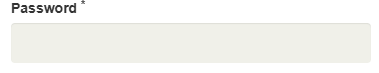
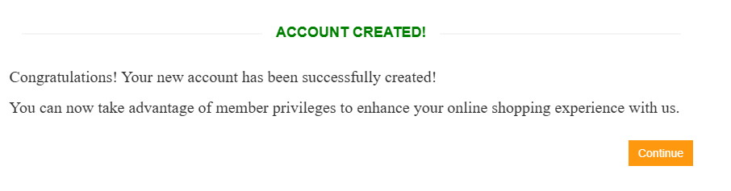
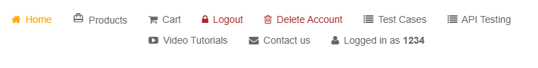
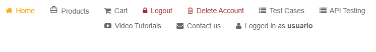

1- Abrir el navegador con la siguiente dirección: https://automationexercise.com/login
 

2- Se verifica que el texto "New User Signup!" sea visible

3- Se rellenan los datos "Email Address" y "Name" en la opción "New User Signup!" y luego pulsar el botón "Signup"

4- Verificar que el texto "Enter Account Information" sea visible

5- Rellenar los campos que tengan "*".

6- Pulsar el botón "Create Account button"

7- Verificamos que el texto "ACCOUNT CREATED" sea visible y pulsamos el botón "Continue"

8- Verificar que se ha registrado correctamente

9- Pulsamos la opción "Logout" para deslogerse
